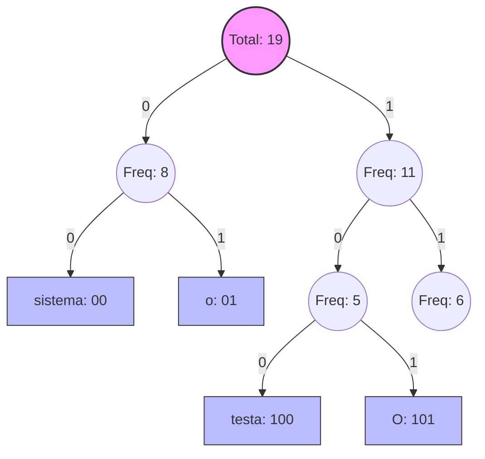

# 📦 Huffman Text Compressor

> Implementação modular do Algoritmo de Huffman para compressão de textos baseada em palavras.


## 📖 Sobre o Projeto

Este projeto foi desenvolvido como parte da disciplina de Algoritmos e Estruturas de Dados. O objetivo é realizar a compressão de textos (lossless) utilizando a **Codificação de Huffman**.

Diferente das implementações tradicionais baseadas em caracteres, este compressor opera baseado na **frequência de palavras**, otimizando a compressão para frases com termos recorrentes.

### ✨ Funcionalidades Principais
- **Tokenização Inteligente:** Separação por espaços em branco, mantendo a pontuação atrelada à palavra para garantir a reconstrução exata do texto.
- **Visualização da Árvore:** O arquivo de saída gera uma representação visual (ASCII art) da estrutura da árvore de Huffman.
- **Arquitetura Modular:** Código organizado em pacote Python (`src/huffman`) com separação clara de responsabilidades (SOLID).
- **Sem Dependências Complexas:** Executável em qualquer ambiente Linux com Python 3 padrão.

---

## 🚀 Como Executar

### Pré-requisitos
- Python 3.6 ou superior instalado.

### Passo a Passo

1. **Clone o repositório:**
   ```bash
   git clone <URL_DO_SEU_REPOSITORIO>
   cd huffman-compressor
   ```

2. **Prepare a entrada (Opcional):**
    O arquivo `data/input.dat` já vem com textos de exemplo. Se desejar, edite-o mantendo uma linha em branco entre cada texto.

3. **Execute o compressor:**
    Utilize o script de automação para configurar o ambiente e rodar:

    ```bash
    chmod +x run.sh
    ./run.sh
    ```

    *Alternativamente, via Python direto:*

    ```bash
    export PYTHONPATH=$PYTHONPATH:$(pwd)/src
    python3 src/main.py
    ```

4. **Verifique a Saída:**
    O resultado será gerado em `data/output.dat`, contendo a árvore, os códigos e o binário comprimido.

-----

## 📊 Entendendo o Algoritmo (Visualização)



-----

## 📂 Estrutura do Projeto

```text
.
├── data/
│   ├── input.dat
│   └── output.dat
├── src/
│   ├── main.py
│   └── huffman/
│       ├── builder.py
│       ├── encoder.py
│       ├── frequency.py
│       ├── serializer.py
│       ├── tokenizer.py
│       └── tree.py
├── run.sh
└── README.md
```

-----

## 🛠 Decisões de Implementação

1. **Tokenização (Whitespace Split):**
   `"Olá, mundo!"` → `["Olá,", "mundo!"]`.

2. **Serialização Visual:** Gera ASCII art da árvore.

-----

## 👨‍💻 Autor

**Seu Nome** *Engenharia de Computação - CEFET-MG*  
Data: 06/12/2025
